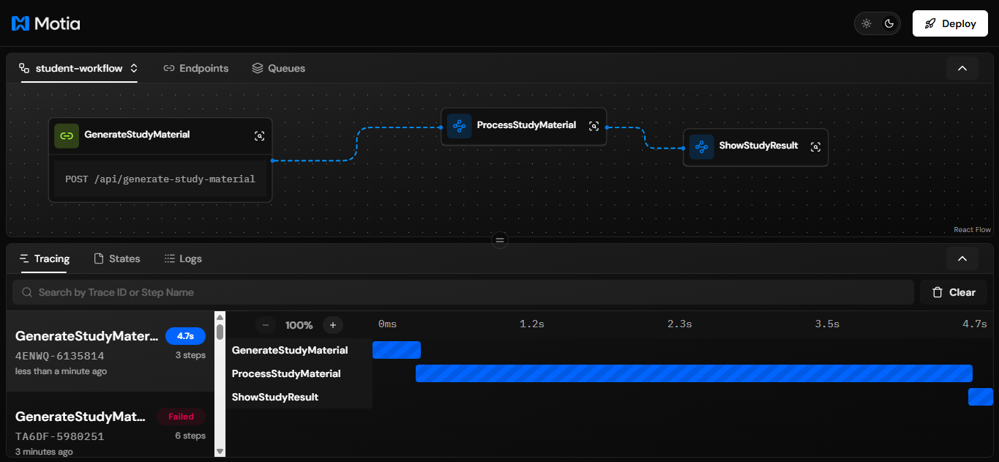
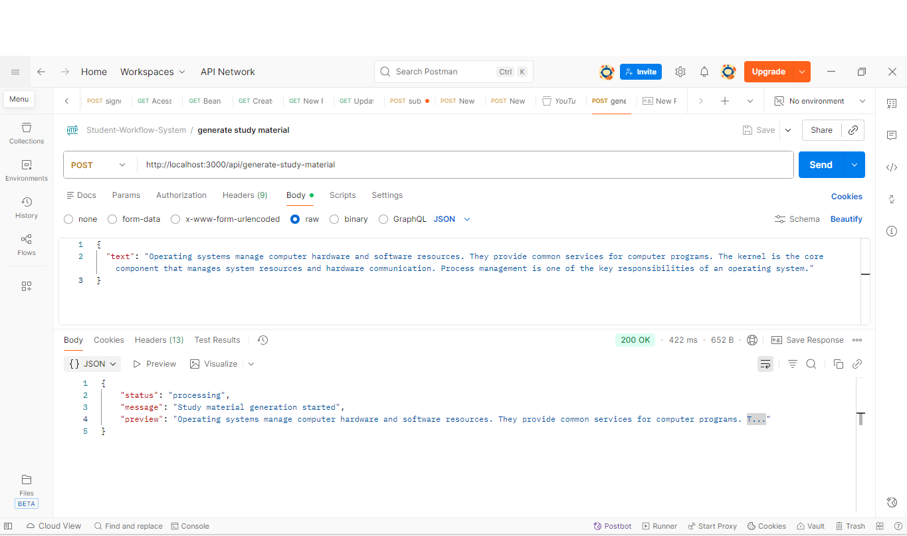
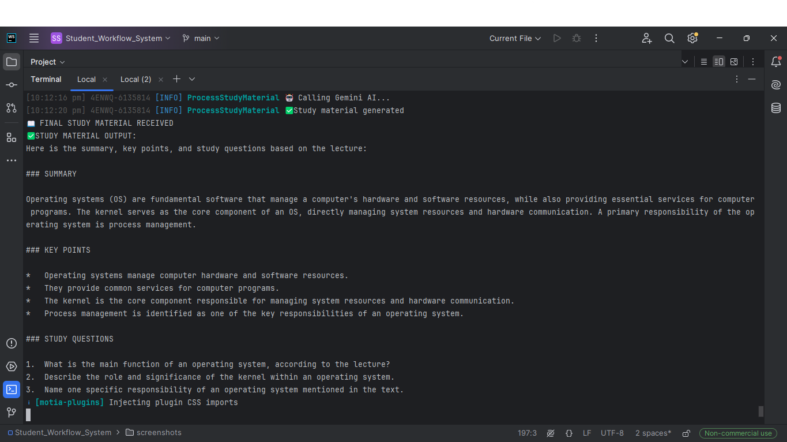

# 📚 Student Workflow System

An **event‑driven study material generator** built with **Motia**, **BullMQ**, and **Google Gemini AI**.  
This system takes raw lecture text and automatically converts it into **summaries, key points, and study questions** using a clean workflow-based backend architecture.

---

## 🚀 Features

- ✅ Event‑driven architecture using **Motia workflows**
- 🤖 AI‑powered study material generation (Gemini API)
- 🔄 Asynchronous processing with **BullMQ + Redis**
- 🧠 Clean separation of concerns (API → Event → AI → Result)
- 📊 Real‑time logs & workflow tracing via Motia Workbench

---

## 📸 Demo & Output

### Motia Workbench (Workflow Execution)

### API Request (Postman-Generated Study Material)

### Final Study Material Output


## 🧩 Architecture Overview

```
Client (Postman / Frontend)
        │
        ▼
GenerateStudyMaterial (API Step)
        │ emits
        ▼
study.submit (Event)
        │
        ▼
ProcessStudyMaterial (AI Event Step)
        │ emits
        ▼
study.completed (Event)
        │
        ▼
ShowStudyResult (Event Logger)
```

Each step is **loosely coupled**, making the system scalable and production‑ready.

---

## 🛠️ Tech Stack

- **Node.js** (v20+)
- **TypeScript**
- **Motia** (workflow engine)
- **BullMQ** (queue & background jobs)
- **Redis** (in‑memory job store)
- **Google Gemini API** (AI generation)

---

## 📂 Project Structure

```
Student_Workflow_System
│
├── steps/
│   ├── generate-study-material.step.ts   # API entry point
│   ├── process-study-material.step.ts    # AI processing logic
│   └── show-study-result.step.ts          # Final output logger
│
├── motia.config.ts
├── package.json
├── .env
└── README.md
```

---

## ⚙️ Setup Instructions

### 1️⃣ Install dependencies

```bash
npm install
```

### 2️⃣ Environment variables

Create a `.env` file in the root:

```env
GEMINI_API_KEY=your_gemini_api_key_here
```

> ⚠️ Do NOT commit this file to GitHub

---

### 3️⃣ Run the development server

```bash
npm run dev
```

You should see:

```
🚀 Server ready and listening on port 3000
🔗 Open http://localhost:3000 to open workbench
```

---

## 🧪 How to Use (API)

### Endpoint

```
POST /api/generate-study-material
```

### Request Body

```json
{
  "text": "Operating systems manage computer hardware and software resources..."
}
```

### Response

```json
{
  "message": "✅ Processing started!",
  "note": "Study material is being generated via workflow"
}
```

The final AI‑generated output will appear in the **terminal logs** via the `ShowStudyResult` step.

---

## 📤 Sample Output

```
📖 FINAL STUDY MATERIAL RECEIVED

SUMMARY:
Operating systems manage hardware and software resources and provide services for programs...

KEY POINTS:
- OS manages system resources
- Kernel is the core component
- Process management is a key responsibility

STUDY QUESTIONS:
1. What is the role of an operating system?
2. Why is the kernel important?
3. What is process management?
```

---

## 🔍 Debugging Tips

- If you see `Function handler not found`, ensure:
    - You are using **named exports** (`export const handler`)
    - NOT `export default`

- Redis `ECONNRESET` errors usually mean:
    - A step is crashing repeatedly
    - Fixing the step resolves Redis automatically

---

## 🌱 Future Improvements

- 🌐 Frontend UI (React / Vanilla HTML)
- 📩 Email delivery of study materials
- 🗄️ Persist results using Motia States plugin
- 🔁 Polling or WebSocket‑based result retrieval

---

## 🧠 Learning Outcome

This project demonstrates **real‑world backend engineering concepts**:

- Event‑driven systems
- Async job queues
- AI integration
- Observability & tracing

Perfect for **hackathons, portfolios, and advanced backend learning**.

---

## 🏆 Author

Built with ❤️ by **Ruturaj Pawar**

> "Not just generating content — generating understanding."
>
> 

